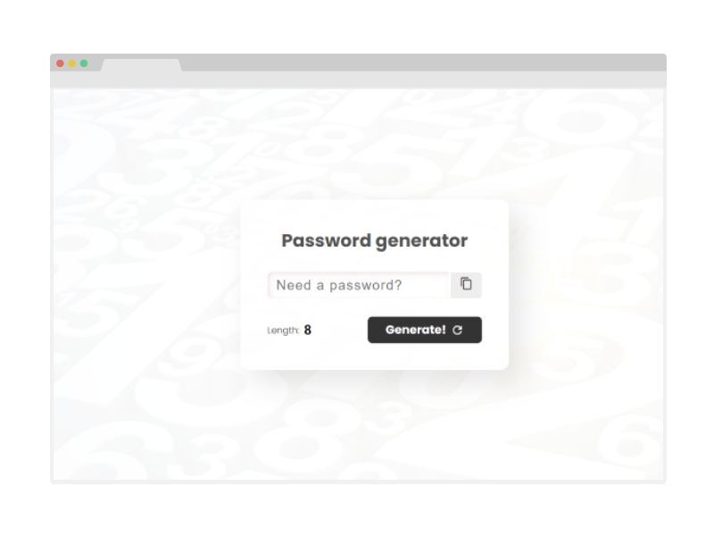

<!-- PROJECT LOGO -->
 

<h3 align="center">Password-Generator-JS</h3>

  

    Based on HTML, CSS and Javascript, create a hexadecimal password since a custom length
     
    <a href="https://passwordgeneratorjs.web.app/">View Demo</a>
  

<!-- TABLE OF CONTENTS -->

  
Table of Contents

  <ol>
    <li>
      <a href="#about-the-project">About The Project</a>
      <ul>
        <li><a href="#built-with">Built With</a></li>
      </ul>
    </li>
    <li><a href="#contributing">Contributing</a></li>
  </ol>

<!-- ABOUT THE PROJECT -->
## About The Project

I created this project to return complex password in a fast way to use on my daily activities.

(<a href="#top">back to top</a>)

### Built With

* HTML
* CSS
* Vanilla Javscript
* Firebase
* Photoshop

(<a href="#top">back to top</a>)

<!-- CONTRIBUTING -->
## Contributing

Contributions are what make the open source community such an amazing place to learn, inspire, and create. Any contributions you make are **greatly appreciated**.

If you have a suggestion that would make this better, please fork the repo and create a pull request. You can also simply open an issue with the tag "enhancement".
Don't forget to give the project a star! Thanks again!

(<a href="#top">back to top</a>)

